# Movie Recommendation Using Multi-Field FFM 


## Abstract 


In this project our team focused on generating movie recommendations to old users in the movie rating system based on rating information and movie information. We used only bias term model and matrix factorization to build our baseline model. And in order to enhance the power of our model, we used FFM to incoorperate several types of movie information like movie genres, movie years and moive countries. MSE and NDCG were used to evaluate model accuracy and 3-fold cross validation was used for hyper parameter tuning(hidden dimension k for FFM model). Finally, we ensembeled several fields that can be used to enhance model accuray into FFM and build our final model for movie recommendation.  


## Dataset & Framework


The dataset we used for this project is movielens together with web crawled information from imdb. However, in the dataset, all the information we can know about users is their rating behaviours, so it is unlikely to solve the new user cold start problem. Therefore in the scope of this project, we focus on how to generate high quality recommendation to old users in our system. And we also proposed how to select good movies as cold start moives used to recommend to new users.


The model we used for this FFM model. FFM is appropriate when movie information is incoperated with the rating information and can be viewed as the generalization of  matrix factorization. In this project, we tested several movie information that may be helpful for user preference prediction, including moive genres(provided), movie tags(generated by LDA), recently rated movies, movie years and movie countries. The evaluation metric we used is mse and ranking mse. After these models been built, we evaluated their performance on different users with different activity levels. And finally we ensembled these results to produce the final movie recommendation model. The upper part of the figure shown below is our main work, and in order to be self contained, we also have some suggestions on how to recommend movies to new users in the end of this report.

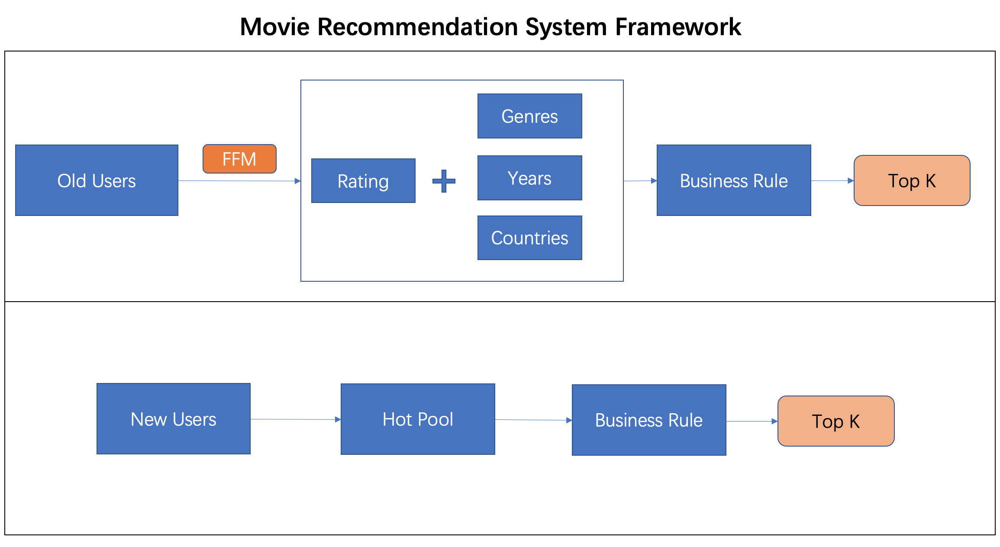


## Model and Results 

The provided movielens dataset contains movies information like moive genres, movive years, which we think are not enough to represent a movie. So we crawled other movie information like movie tags and movie countries from imdb to make the movie information more complete. Since we run our model on a single machine, we choose to use a movie sample containing 3357 movies to do the recommendation. And we selected users having rating records on these 3357 movies with at least 15 times. The reason to choose 15 is that since we will do 3-fold cross validation to tune the hyper parameter, we want one user has at least 5 records in test set otherwise the ranking method will not that useful.

The main package we used for this project is xlearn. xLearn is a high-performance, easy-to-use, and scalable machine learning package, which can be used to solve large-scale machine learning problems, especially for the problems on large-scale sparse data, which is very common in scenes like CTR prediction and recommender system. xlearn is written in C++ and Python wrapper is provided. xlearn is much faster than libffm and libfm. So it's worth trying.

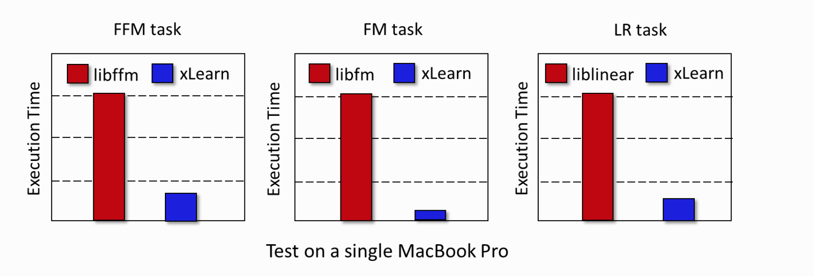


### Baseline 

We used 2 models served as our baseline models. First one only consider bias terms of users and movies, and second one is FFM model only incoorperates rating information.

#### User Bias + Movie Bias Baseline 

We implemented this base line using surprise and did 5 fold cross validation. RMSE for this baseline is 0.8438 

```Python 
from surprise import NormalPredictor
from surprise import Dataset
from surprise import Reader
from surprise import SVD
from surprise import BaselineOnly
from surprise.model_selection import cross_validate

reader = Reader(rating_scale=(1, 5))
data = Dataset.load_from_df(ratings_high[['user_id', 'movie_id', 'rating']], reader)
algo = BaselineOnly()
cross_validate(algo, data, measures=['RMSE', 'MAE'], cv=5, verbose=True) 

```

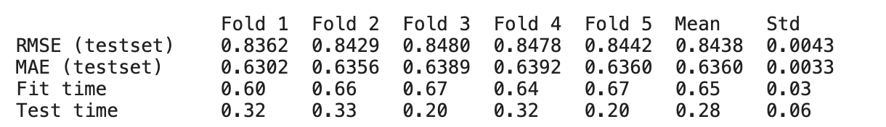


#### FFM + Rating Information

In the FFM framwork, if we do not add any other information, then FFM is just the same as matrix factorization. After running these 3 line of codes we can get the result.(The implementation of these functions can be seen in the Appendix). The best mse and NDCG for this baseline is 0.824 and 0.906 and k is 4.


```Python 
ffm_CV(ratings_high,["rating","user_index","movie_index"],"mf")
k_lst = [1,3,5,10,15,20,25,30,35,40,45,50]
base_res = ffm_cv_eval(k_lst, "mf")
```
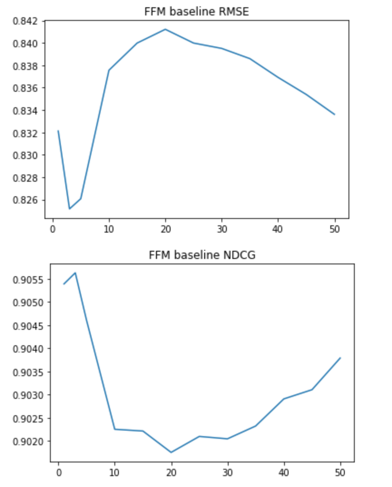


### Add Genres 

Movie genres contain infromation about which catogory a movie belongs to, and users often can have preferences on genres, we have a case to show this below. We crawled movie tags from IMDB and implemented LDA to give movies topic and we also used movie genres provided by movielens. Result showed that movie genre provided by movielens is a better choice.


#### Add IMDB Tags 

We use LDA to embedding tag information for each movies, we systematically try wide range of topic numbers and choose the 50 hidden number of topics as it gives the best performance. 

We visualize the topic tags distribution as well as document topics distribution. We can see that there is a clear pattern in the tags distribution in topics 3 and topics 6 which is about violence and illness. Some topics don’t reveal much information as the data is not complete, we believe adding more data will result in a better topic word distribution. 
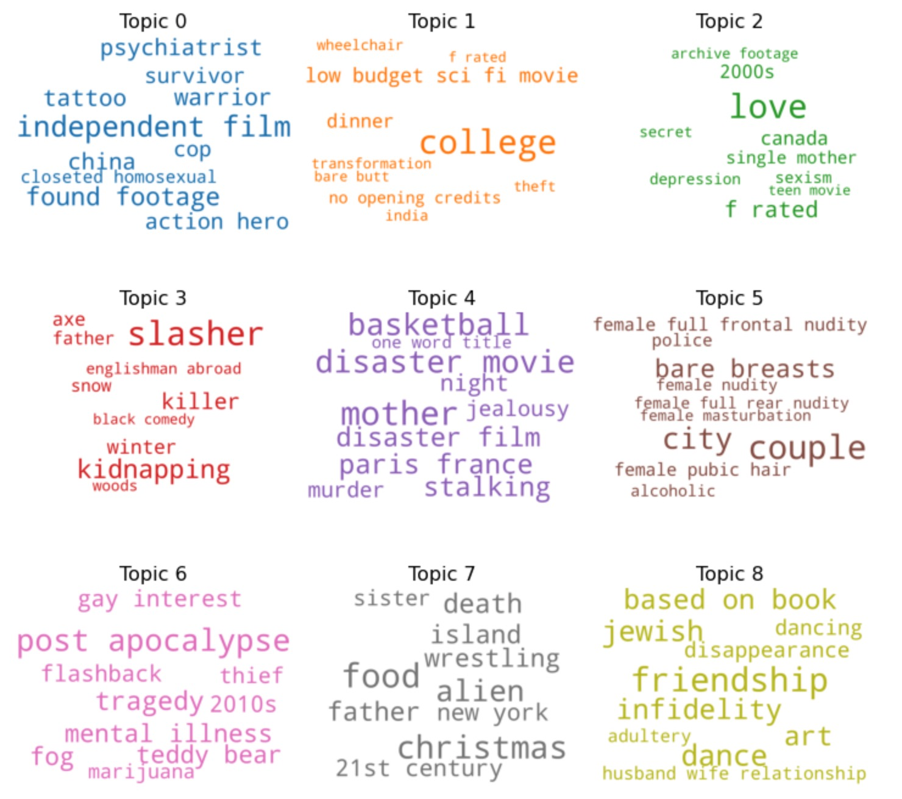


As for document topic distribution, there are many documents to be explored we select two document to see there distribution difference, we see there indeed exist great variety in topic distribution between documents between theses two movies.

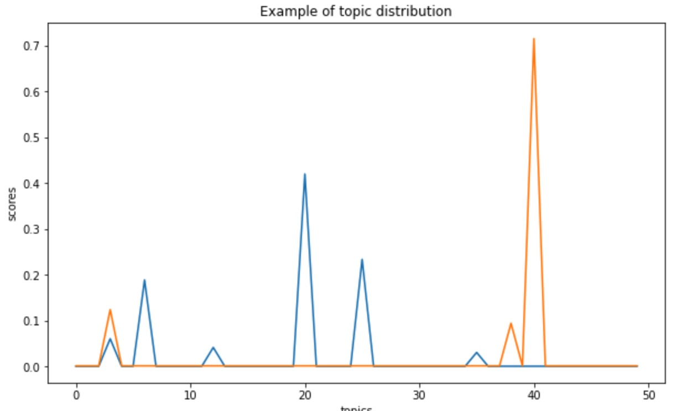

The orange line is accuracy of adding genres while the blue line is the baseline. Adding this information can beat the baseline model. k = 5 is the best choice. Sepecific data can be seen in our notebook.

```Python 
ratings_high = Add_tag(ratings_high)
ffm_CV(ratings_high,["rating","user_index","movie_index","tag_index"],"mf_tag")
tag_res = ffm_cv_eval(k_lst, "mf_tag")

sns.lineplot(x=k_lst, y=base_res[0]);
sns.lineplot(x=k_lst, y=tag_res[0]);
plt.title("FFM add tag vs baseline RMSE")
plt.show()
sns.lineplot(x=k_lst, y=base_res[1]);
sns.lineplot(x=k_lst, y=tag_res[1]);
plt.title("FFM add tag vs baseline NDCG")
plt.show()
```

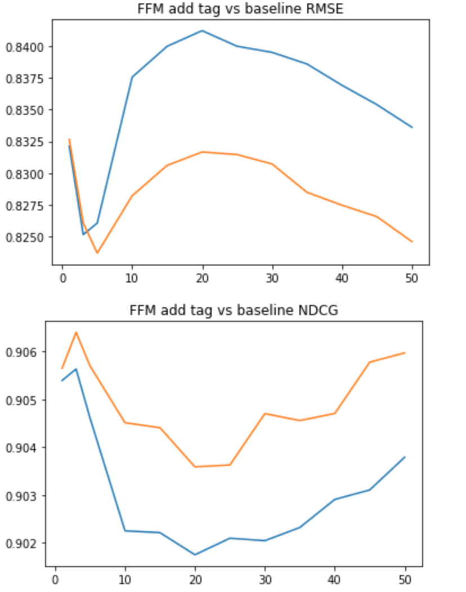


#### Add Genres

The orange line is accuracy of adding genres while the blue line is the baseline. Adding this information can beat the baseline model. k = 40 is the best choice. Sepecific data can be seen in our notebook.


```Python 
ratings_high = Add_genre(ratings_high)
ffm_CV(ratings_high,["rating","user_index","movie_index","genre_index"],"mf_genre")
genre_res = ffm_cv_eval(k_lst, "mf_genre")

sns.lineplot(x=k_lst, y=base_res[0]);
sns.lineplot(x=k_lst, y=genre_res[0]);
plt.title("FFM add genre vs baseline RMSE")
plt.show()
sns.lineplot(x=k_lst, y=base_res[1]);
sns.lineplot(x=k_lst, y=genre_res[1]);
plt.title("FFM add genre vs baseline NDCG")
plt.show()
```

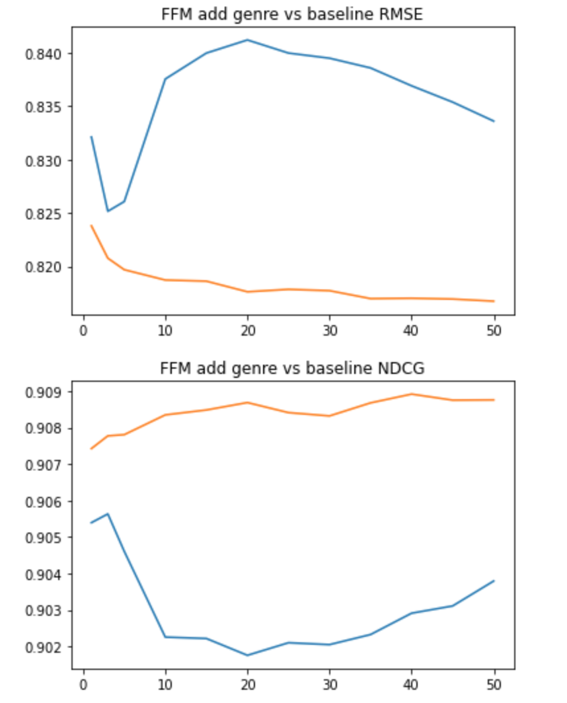


- Plot genre ratings 

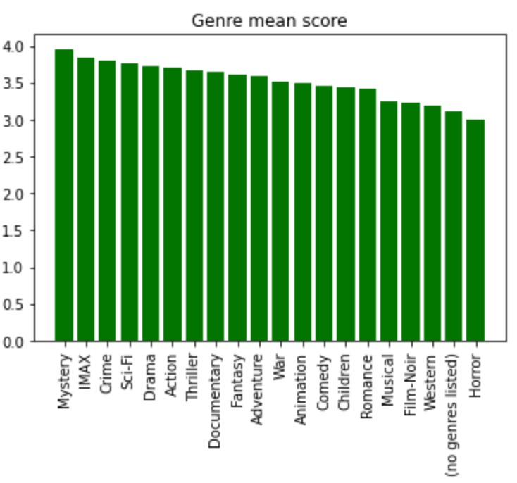


- User genre 

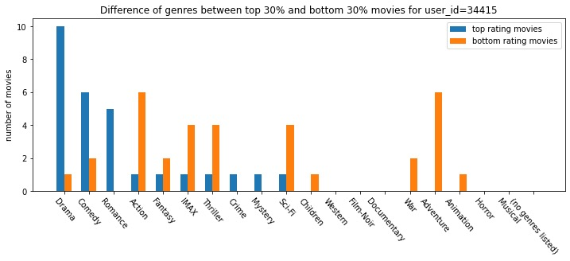


### Add Time 

We assumed that users' preferences will change over time, so it might be a good choice to let the machine learn this information. We added a field called recently rated movies to record recent 3 moives a user rated when this user is rating a movie. The result is shown below. The orange line is accuracy of adding this information while the blue line is the baseline. However, the result is quite bad.


```Python 
ratings_high = Add_recent(ratings_high)
ffm_CV(ratings_high,["rating","user_index","movie_index","recent_index"],"mf_recent")
recent_res = ffm_cv_eval(k_lst, "mf_recent")


sns.lineplot(x=k_lst, y=base_res[0]);
sns.lineplot(x=k_lst, y=recent_res[0]);
plt.title("FFM add recent rated moive vs baseline RMSE")
plt.show()
sns.lineplot(x=k_lst, y=base_res[1]);
sns.lineplot(x=k_lst, y=recent_res[1]);
plt.title("FFM add recent rated movie vs baseline NDCG")
plt.show()
```

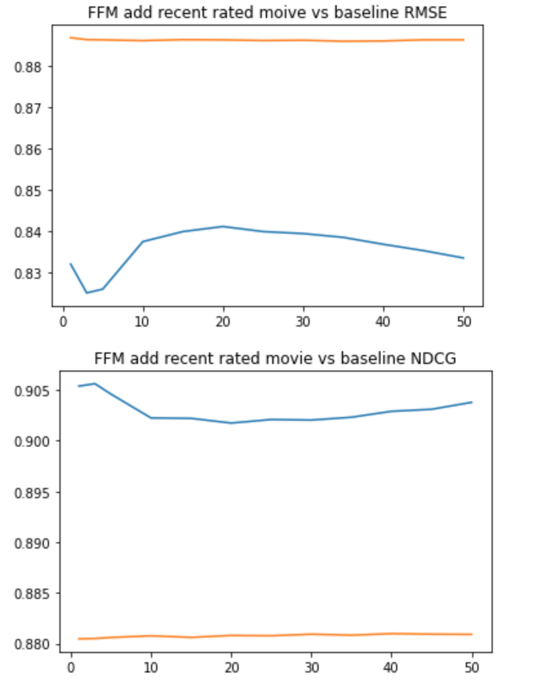


### Add Year

The orange line is accuracy of adding genres while the blue line is the baseline. Adding this information can beat the baseline model. k = 90 is the best choice. Sepecific data can be seen in our notebook.


```Python 
ratings_high = Add_year(ratings_high)
ffm_CV(ratings_high,["rating","user_index","movie_index","year_index"],"mf_year")
year_res = ffm_cv_eval(k_lst+[70,90,110], "mf_year")

sns.lineplot(x=k_lst, y=base_res[0]);
sns.lineplot(x=k_lst, y=year_res[0]);
plt.title("FFM add moive year vs baseline RMSE")
plt.show()
sns.lineplot(x=k_lst, y=base_res[1]);
sns.lineplot(x=k_lst, y=year_res[1]);
plt.title("FFM add movie year vs baseline NDCG")
plt.show()
```

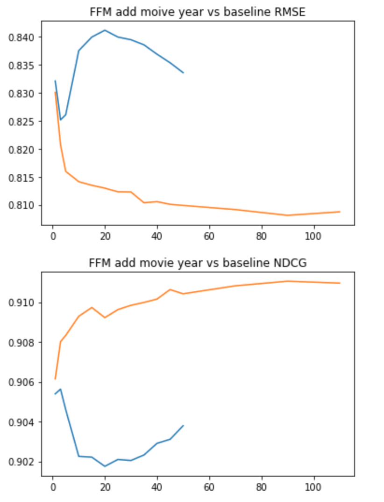


We saw the movie from 80s receive the highest mean score, and we think the return to studio-driven pictures in 80s plays an important role in the high popularity of the films. The idea of Hollywood film making concept changed in 80s from plain story telling to highly marketable and understandable cinematic plots that could be summarized in one or two sentences. 
We saw 2010 ranked second, it probability because the massive use of 3D technology following the success of Avatar.

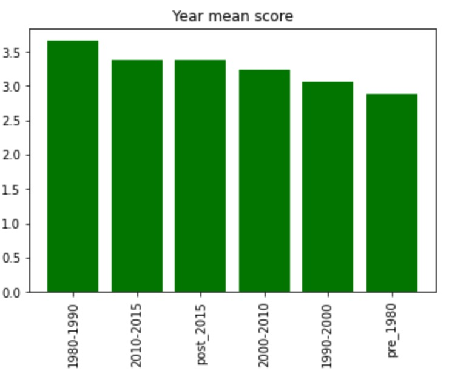


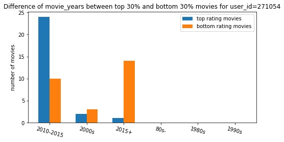


### Add Country

The orange line is accuracy of adding genres while the blue line is the baseline. Adding this information can beat the baseline model. k = 45 is the best choice. Sepecific data can be seen in our notebook.


```Python 
ratings_high = Add_country(ratings_high)
ffm_CV(ratings_high,["rating","user_index","movie_index","country_index"],"mf_country")
country_res = ffm_cv_eval(k_lst, "mf_country")

sns.lineplot(x=k_lst, y=base_res[0]);
sns.lineplot(x=k_lst, y=country_res[0]);
plt.title("FFM add moive country vs baseline RMSE")
plt.show()
sns.lineplot(x=k_lst, y=base_res[1]);
sns.lineplot(x=k_lst, y=country_res[1]);
plt.title("FFM add movie country vs baseline NDCG")
plt.show()

```

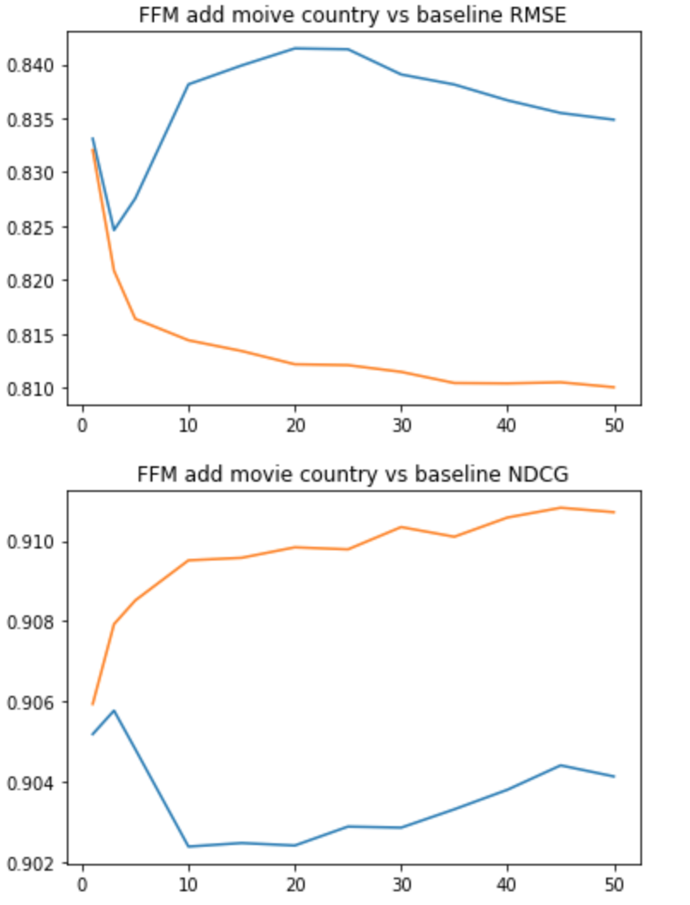


According to the result, it shows that country information is helpful in determining the rating of the movie, we classify the movie according to the region. We saw an improvement in the overall score once added the country information to model.

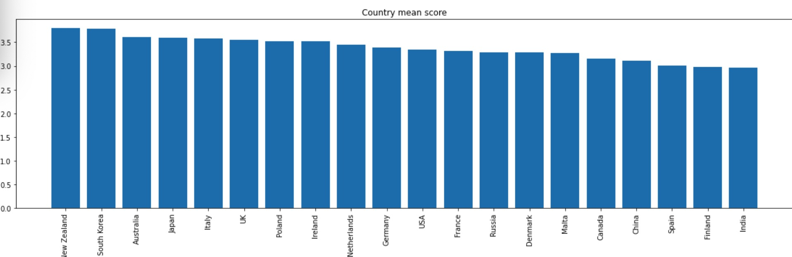


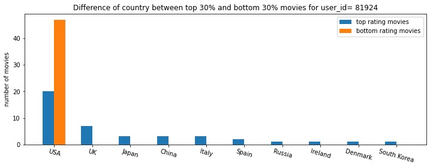


### Ensemble 

The orange line is accuracy of adding genres while the blue line is the baseline. Doing ensemble can beat the baseline model. k = 25 is the best choice. Sepecific data can be seen in our notebook. From the plot we can see that although the pure accuray is not as high as accuracy before ensemble, the variation of the result became small. So doing ensemble gives us a more stable result.

```Python 
ratings_high = data_sampling()
ratings_high = Add_country(ratings_high)
ratings_high = Add_year(ratings_high)
ratings_high = Add_genre(ratings_high)

ratings_high.country_index = ratings_high.country_index.apply(
        lambda x: "3:"+str(int(x.split(":")[1])+20)+":1")
ratings_high.year_index = ratings_high.year_index.apply(
        lambda x: "4:"+str(int(x.split(":")[1])+20+89)+":1")

ffm_CV(ratings_high,["rating","user_index","movie_index","genre_index","country_index","year_index"],"mf_ensemble")
k_lst = [1,3,5,10,15,20,25,30,35,40,45,50]
ensem_res = ffm_cv_eval(k_lst, "mf_ensemble")

```

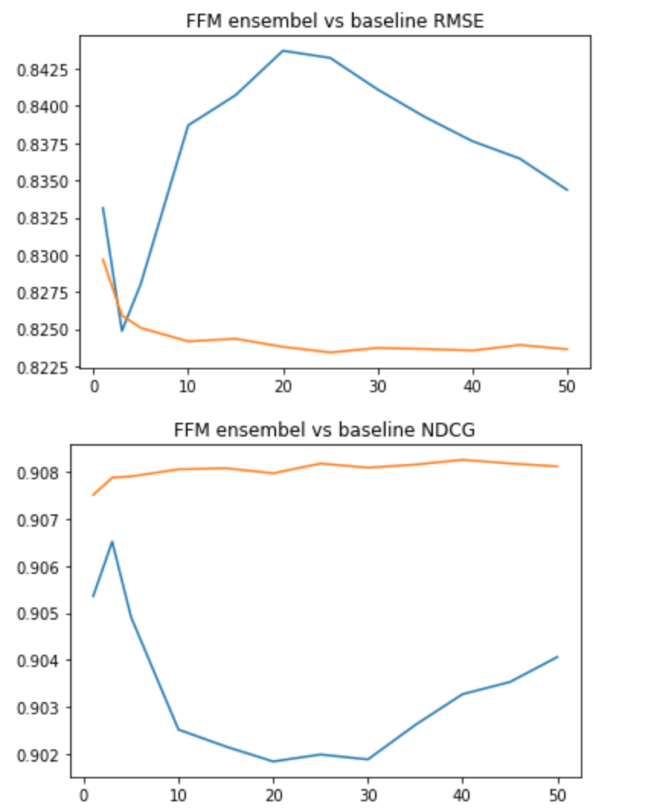


## Generate Recommendation 

After our model has been built, we can generate recommendations to old users. And for new users, our model can not work on them since they have no rating records in the system. One solution to solve this probelm is to recommend movies with highest ctr rate and rating score, in this case new users will click the link with highest probability and we can have activity information about this user, and then we can do recommendations.


## Conclusion 

In this project we used FFM to combine rating information and multi-fields to build our recommendation model. One reason to choose this kind of linear model instead of deep learning models is that linear models have better interpretibility. And our result showed that adding movie information truely helps improve model accuracy and can do better recommendations. This practice is also meaningful in business practice. The model we proposed can be used to solve old user recommendation problems. Another advantage of using our model in practice is that FFM can used for online learning, once the model is trained, making prediction is really fast.


## Apendix 


```Python 
import pandas as pd  
import xlearn as xl  
import numpy as np 
import re 
import matplotlib.pyplot as plt 
import seaborn as sns


def data_sampling():
    # read data 
    movie_ids = pd.read_csv("./movie_info.csv")[["movie_id","movie_rating","movie_year","movie_detail"]]
    links = pd.read_csv("./links.csv")
    ratings = pd.read_csv("ratings.csv")

    # merge imdb movieid and movielens movieid
    links.columns = ["id","movie_id","tmdbId"]
    movie_ids = pd.merge(links,movie_ids,on="movie_id",how="inner")
    ratings.columns = ['user_id','id','rating','timestamp']
    ratings = pd.merge(ratings,movie_ids,on="id",how="inner")

    # sample users with more than 15 ratings
    user = ratings["user_id"].value_counts().reset_index()
    user = user[user.user_id>=15][["index"]]
    user.columns = ["user_id"]
    ratings_high = pd.merge(ratings,user,on="user_id",how="inner")
    ratings_high = ratings_high[['user_id','id','rating','timestamp','movie_rating','movie_year','movie_detail']]
    ratings_high.columns = ['user_id','movie_id','rating','timestamp','movie_rating','movie_year','movie_detail']


    # generate user index and movie index
    ratings_high_user = ratings_high.drop_duplicates(subset="user_id") \
        .sort_values(by="user_id").reset_index()['user_id'].reset_index()
    ratings_high_movie = ratings_high.drop_duplicates(subset="movie_id") \
        .sort_values(by="movie_id").reset_index()['movie_id'].reset_index()

    # merge dataframe 
    ratings_high = pd.merge(ratings_high,ratings_high_user,on="user_id",how="inner")
    ratings_high = pd.merge(ratings_high,ratings_high_movie,on="movie_id",how="inner")

    # change format to ffm format 
    ratings_high.columns = ['user_id','movie_id','rating','timestamp','movie_rating','movie_year','movie_detail','user_index','movie_index']
    ratings_high['movie_index'] = ratings_high['user_index'].max() + 1 + ratings_high['movie_index'] 
    ratings_high['user_index'] = ratings_high['user_index'].apply(lambda x: "0:"+str(x)+":1")
    ratings_high['movie_index'] = ratings_high['movie_index'].apply(lambda x: "1:"+str(x)+":1")

    # create 3 fold cv for hyper parameter tuning 
    ratings_high['rand'] = np.random.random(ratings_high.shape[0])
    ratings_high['rank'] = ratings_high.groupby("user_id")['rand'].rank(ascending=True,method="first")
    user_rating_num = ratings_high.groupby("user_id")["rank"].max().reset_index()
    ratings_high = pd.merge(ratings_high,user_rating_num,on="user_id",how="inner")
    ratings_high["group"] = ratings_high["rank_x"]/ratings_high["rank_y"]
    
    return ratings_high

def ffm_CV(ratings_high,columns,file_name):

    # Generate 3 fold cv

    ratings_high_train = ratings_high[columns][ratings_high.group>=0.33]
    ratings_high_test = ratings_high[columns][ratings_high.group<0.33]

    ratings_high_train.to_csv("./xlearn/"+file_name+"/ratings_high_train1.txt",
                                                                 sep=" ",
                                                                 index=False,
                                                                 header=None)
    with open("./xlearn/"+file_name+"/ratings_high_train1.txt", "r") as f:
        s = f.read()
    s = s.replace('"','')
    with open("./xlearn/"+file_name+"/ratings_high_train1.txt", 'w') as f:
        f.write(s)


    ratings_high_test.to_csv("./xlearn/"+file_name+"/ratings_high_test1.txt",
                                                                 sep=" ",
                                                                 index=False,
                                                                 header=None)
    with open("./xlearn/"+file_name+"/ratings_high_test1.txt", "r") as f:
        s = f.read()
    s = s.replace('"','')
    with open("./xlearn/"+file_name+"/ratings_high_test1.txt", 'w') as f:
        f.write(s)

    ratings_high_train = ratings_high[columns][(ratings_high.group<0.33)|(ratings_high.group>0.66)]
    ratings_high_test = ratings_high[columns][(ratings_high.group>=0.33)&(ratings_high.group<=0.66)]

    ratings_high_train.to_csv("./xlearn/"+file_name+"/ratings_high_train2.txt",
                                                                 sep=" ",
                                                                 index=False,
                                                                 header=None)
    with open("./xlearn/"+file_name+"/ratings_high_train2.txt", "r") as f:
        s = f.read()
    s = s.replace('"','')
    with open("./xlearn/"+file_name+"/ratings_high_train2.txt", 'w') as f:
        f.write(s)
    
    ratings_high_test.to_csv("./xlearn/"+file_name+"/ratings_high_test2.txt",
                                                                 sep=" ",
                                                                 index=False,
                                                                 header=None)
    with open("./xlearn/"+file_name+"/ratings_high_test2.txt", "r") as f:
        s = f.read()
    s = s.replace('"','')
    with open("./xlearn/"+file_name+"/ratings_high_test2.txt", 'w') as f:
        f.write(s)


    ratings_high_train = ratings_high[columns][ratings_high.group<=0.66]
    ratings_high_test = ratings_high[columns][ratings_high.group>0.66]

    ratings_high_train.to_csv("./xlearn/"+file_name+"/ratings_high_train3.txt",
                                                                 sep=" ",
                                                                 index=False,
                                                                 header=None)
    with open("./xlearn/"+file_name+"/ratings_high_train3.txt", "r") as f:
        s = f.read()
    s = s.replace('"','')
    with open("./xlearn/"+file_name+"/ratings_high_train3.txt", 'w') as f:
        f.write(s)
    ratings_high_test.to_csv("./xlearn/"+file_name+"/ratings_high_test3.txt",
                                                                 sep=" ",
                                                                 index=False,
                                                                 header=None)
    with open("./xlearn/"+file_name+"/ratings_high_test3.txt", "r") as f:
        s = f.read()
    s = s.replace('"','')
    with open("./xlearn/"+file_name+"/ratings_high_test3.txt", 'w') as f:
        f.write(s)


def ffm_cv_eval(k_lst, file_name):

    def NDCG(t):
        """
        compute NDCG for a user
        t: pandas dataframe 
        """
        rank = np.array(sorted(t['ranking'].values)[::-1])
        DCG = t.sort_values(by=["ranking"],ascending=False).rating.values
        IDCG = np.array(sorted(DCG))
        NDCG = (np.sum((2**(DCG)-1)/np.log2(rank+1))) / (np.sum((2**(IDCG)-1)/np.log2(rank+1)))
        return NDCG

    
    mse_lst = []
    NDCG_lst = []
    for k in k_lst:

        param = {'task':'reg', 'lr':0.2, 'lambda':0.02, 'metric':'mae', 'k':k}
        mse = []
        ndcg = []
        for i in ['1','2','3']:

            ffm_model = xl.create_ffm()               
            ffm_model.setTrain("./xlearn/"+file_name+"/ratings_high_train"+i+".txt")

            #ffm_model.setTXTModel("./xlearn/model.txt")
            ffm_model.fit(param, "./xlearn/"+file_name+"/ratings_high_model"+i+".out")

            # Prediction task
            ffm_model.setTest("./xlearn/"+file_name+"/ratings_high_test"+i+".txt")  # Set the path of test dataset
            # Start to predict
            # The output result will be stored in output.txt
            ffm_model.predict("./xlearn/"+file_name+"/ratings_high_model"+i+".out","./xlearn/"+file_name+"/ratings_high_output"+i+".txt")

            # update mse
            pred_ratings = pd.read_csv("./xlearn/"+file_name+"/ratings_high_output"+i+".txt",header=None)
            pred_ratings = list(pred_ratings[0])
            pred_ratings = [5 if i>5 else i for i in pred_ratings]
            pred_ratings = [0 if i<0 else i for i in pred_ratings]

            label_ratings = pd.read_csv("./xlearn/"+file_name+"/ratings_high_test"+i+".txt",header=None)
            label_ratings[0] = label_ratings[0].apply(lambda x: x.split(" ")[0:3])
            label_ratings["rating"] = label_ratings[0].apply(lambda x: x[0])
            label_ratings["rating"] = label_ratings["rating"].astype(float)
            label_ratings["user_id"] = label_ratings[0].apply(lambda x: x[1])
            label_ratings["movie_id"] = label_ratings[0].apply(lambda x: x[2])
            label_ratings = label_ratings[['rating','user_id','movie_id']]


            mse.append((np.sum((label_ratings["rating"] - pred_ratings)**2)/label_ratings.shape[0])**(1/2))

            # update ndcg
            label_ratings["pred_rating"] = pred_ratings
            label_ratings['ranking'] = label_ratings.groupby("user_id")["pred_rating"].rank(ascending=False,method="first")
            ndcg.append(label_ratings.groupby("user_id").apply(NDCG).mean())

        
        mse_lst.append(np.mean(mse))  
        NDCG_lst.append(np.mean(ndcg))
    
    return mse_lst,NDCG_lst


def Add_genre(ratings_high):

    movie_lda = pd.read_pickle("./genres_encode.pkl")
    movie_lda =  movie_lda[["movieId","genres_vec"]]
    movie_lda.columns = ['movie_id','genre_index']
    index_start = ratings_high.user_id.unique().shape[0] + ratings_high.movie_id.unique().shape[0]
    movie_lda['genre_index'] = movie_lda['genre_index'].apply(lambda x: 
                                 " ".join(["2:"+str(index+index_start)+":"+str(i) 
                                           for index,i in enumerate(x) if i != 0]))
    ratings_high = pd.merge(ratings_high,movie_lda,on="movie_id",how="inner")

    return ratings_high


def Add_tag(ratings_high):

    movie_lda = pd.read_pickle("./movie_lda_50.pkl")
    movie_lda =  movie_lda[["movieId","result"]]
    movie_lda.columns = ['movie_id','tag_index']
    index_start = ratings_high.user_id.unique().shape[0] + ratings_high.movie_id.unique().shape[0]
    movie_lda['tag_index'] = movie_lda['tag_index'].apply(lambda x: 
                                 (" ".join(["2:"+str(index+index_start)+":"+str(i) 
                                           for index,i in enumerate(x) if i >= 0.01])).strip('"'))
    ratings_high = pd.merge(ratings_high,movie_lda,on="movie_id",how="inner")

    return ratings_high

def Add_recent(ratings_high):

    def list_convert(l):
        if l != "":
            return " ".join(l)
        else:
            return ""

    ratings_high['time_rank'] = ratings_high.groupby("user_id")["timestamp"].rank(ascending=True,method="first")
    ratings_high_time = ratings_high[['rating','user_index','movie_index','time_rank']]

    ratings_high_time = pd.merge(ratings_high_time,ratings_high_time[['user_index','movie_index','time_rank']],on="user_index",how="inner")
    ratings_high_time["time_diff"] = ratings_high_time.time_rank_x - ratings_high_time.time_rank_y
    ratings_high_time = ratings_high_time[(ratings_high_time.time_diff>0)&(ratings_high_time.time_diff<4)]
    rating_recent = ratings_high_time.groupby(["user_index","movie_index_x"])["movie_index_y"].apply(lambda x: list(x)).reset_index()
    rating_recent.columns = ['user_index','movie_index','recent_index']
    ratings_high = pd.merge(ratings_high,rating_recent,on=["user_index","movie_index"],how="left")
    ratings_high.fillna("",inplace=True)
    ratings_high.recent_index = ratings_high.recent_index.apply(list_convert)

    return ratings_high


def Add_year(ratings_high):
    def convert_year(year):
        if year == 0:
            return 0
        elif year >= 2010:
            return 1
        elif year >= 2000:
            return 2
        elif year >= 1990:
            return 3
        else:
            return 4
    
    ratings_high["year_index"] = ratings_high.movie_year.apply(convert_year)
    index_start = ratings_high.user_id.unique().shape[0] + ratings_high.movie_id.unique().shape[0]
    ratings_high.year_index = ratings_high.year_index.apply(lambda x: "2:"+str(index_start+x)+":1")

    return ratings_high


def Add_country(ratings_high):

    def convert_country(country):
        if re.findall(r"'Country:(.*?)'",country) == []:
            return 0
        else:
            return re.findall(r"'Country:(.*?)'",country)[0]
        
    ratings_high["country"] = ratings_high['movie_detail'].apply(convert_country)

    movie_country = ratings_high.country.value_counts().reset_index()
    movie_country['country_index'] = [i for i in range(movie_country.shape[0])]
    movie_country.columns = ["country","num","country_index"]
    ratings_high = pd.merge(ratings_high,movie_country[["country","country_index"]],on="country")
    index_start = ratings_high.user_id.unique().shape[0] + ratings_high.movie_id.unique().shape[0]
    ratings_high.country_index = ratings_high.country_index.apply(lambda x: "2:"+str(index_start+x)+":1")
    
    return ratings_high

```


